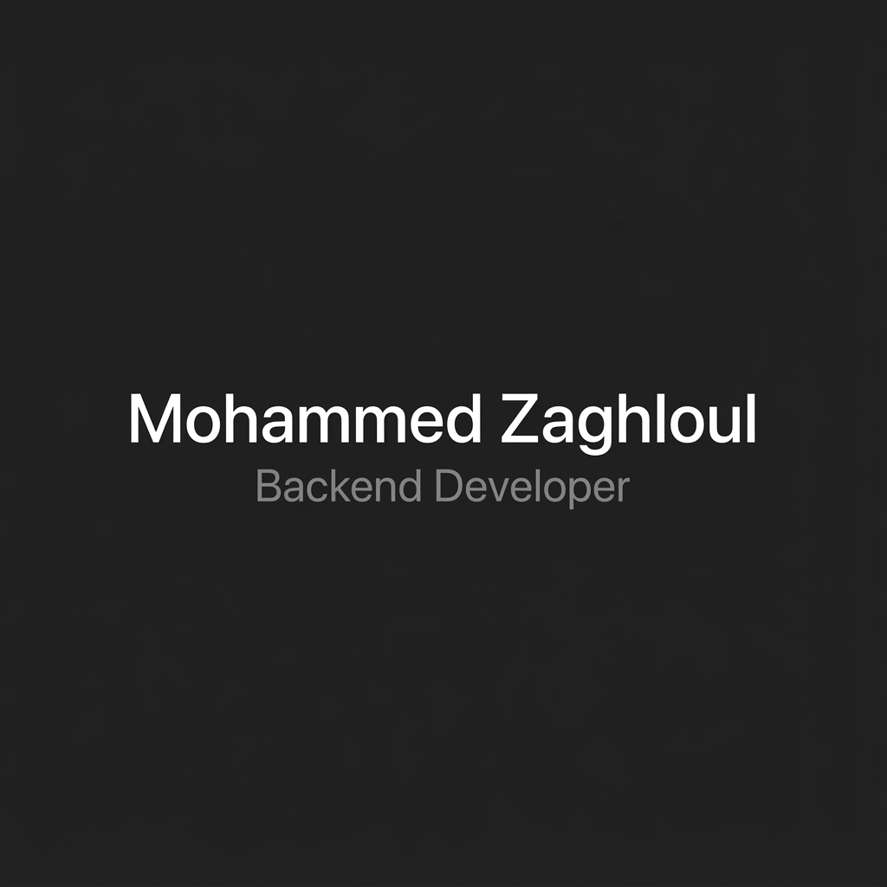

  

# Hi 👋 I'm Mohammed Zaghloul

Backend Developer specializing in ASP.NET Core & Clean Architecture.

📍 Egypt  
💼 Open to Backend .NET Opportunities

  
  
  

---

### 🛠️ Tech Stack
- 🟣 **C# / .NET**
- 🟣 **ASP.NET Core**
- 🟣 **SQL Server**
- 🟣 **Angular**
- 🟣 **Docker**

---

### 📌 Featured Projects

| Project | Description | Tech Stack |
| :--- | :--- | :--- |
| [🏠 Aqar Platform](https://github.com/mohammedzaghloul/MZ.AqarPlatform) | Real Estate Platform built with Clean Architecture, DDD, and Auditing. | ASP.NET Core 10, EF Core, SQL Server, JWT |
| [🔐 Central Auth](https://github.com/mohammedzaghloul/CentralAuthNotificationPlatform-) | OAuth2 & OpenID Connect Auth Server with background email dispatching. | .NET 10, Hangfire, SQL Server |
| [🎓 School Management](https://github.com/mohammedzaghloul/MZ.Dev.School.Api) | QR Code and Face Recognition Attendance System with real-time chat. | .NET, SignalR, QR & Face APIs |
| [🛒 Ecommerce API](https://github.com/mohammedzaghloul/MZ.Dev.Talabat) | Scalable E-commerce API with Generic Repository and Stripe integration. | .NET, Redis, EF Core, Stripe |
| [🌐 Portfolio API](https://github.com/mohammedzaghloul/MZ.Dev.PortfolioAPI) | Backend API with CV uploading, parsing, and projects management. | .NET, EF Core, SQL Server |
| [🛍️ E-Commerce MVC](https://github.com/mohammedzaghloul/MohammedZaghloul) | Full-stack E-commerce MVC app with catalog, cart, and admin dashboard. | .NET Core MVC, EF Core, SQL Server |

---

### 🌱 Currently Exploring
- Microservices
- Event-Driven Architecture
- Kubernetes
- Distributed Systems

---

### 📈 GitHub Stats & Activity

  
  &nbsp;&nbsp;
  
  &nbsp;&nbsp;
  

  

